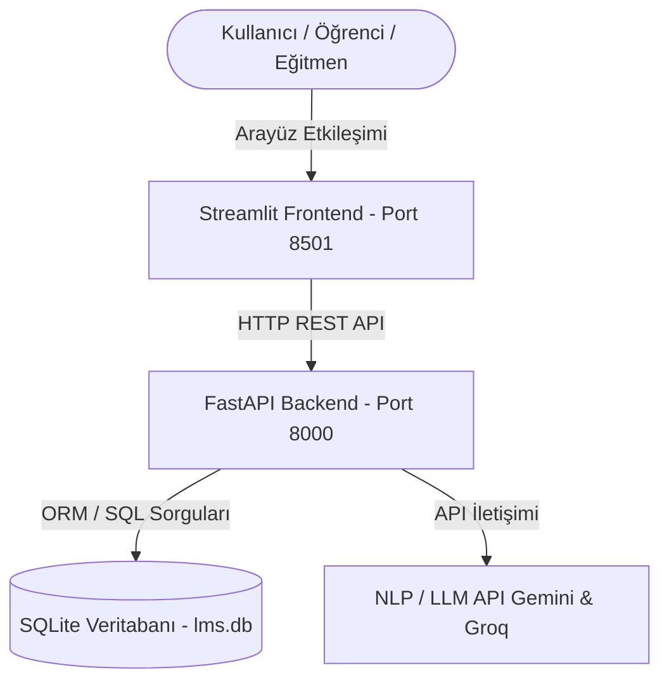

# 🎓 EduAI - Yapay Zekâ Destekli Öğrenme Yönetim Sistemi (LMS)

Yapay Zekâ destekli LMS (Learning Management System) projesidir. Sistem; öğrencilerin ders materyallerini yapay zekâ ile özetlemesine, öğretmenlerin ders/materyal yönetmesine ve öğrencilerin yazdığı ödevlerin yapay zekâ tarafından dilbilgisi, içerik ve anlatım yönünden otomatik analiz edilerek öneri harf notları oluşturulmasına imkan tanır.

---

## 🛠️ Genel Mimari ve Teknolojiler

Uygulama, modern bir web mimarisine sahip olup aşağıdaki teknolojiler kullanılarak inşa edilmiştir:



- **Frontend:** [Streamlit](https://streamlit.io/) (Kullanıcı Dostu, Premium Tema & CSS Özelleştirmeleri)
- **Backend:** [FastAPI](https://fastapi.tiangolo.com/) (Hızlı, Pydantic & SQLAlchemy Destekli REST API)
- **Veritabanı:** [SQLite](https://www.sqlite.org/) (Hafif ve Yerel Veritabanı)
- **Yapay Zekâ Entegrasyonu:**
  - **Gemini API** (`gemini-1.5-flash` modeli)
  - **Groq API** (`llama3-8b-8192` modeli)
  - **Mock AI Modu:** API anahtarı girilmediğinde veya geçersiz olduğunda otomatik devreye giren test modu.

---

## 📂 Dosya Yapısı

```text
lms-yapayzeka-final/
├── app.py              # Streamlit Kullanıcı Arayüzü (Frontend)
├── main.py             # FastAPI Sunucusu & REST API Uç Noktaları (Backend)
├── ai_service.py       # Gemini, Groq ve Mock AI Entegrasyonu (AI Servisi)
├── database.py         # SQLite Veritabanı Bağlantısı ve Güvenli Şifreleme İşlemleri
├── models.py           # SQLAlchemy Veri Tabanı Modelleri ve Pydantic Şemaları
├── requirements.txt    # Gerekli Python Kütüphaneleri listesi
├── .env                # API Anahtarları Şablonu
└── README.md           # Proje Tanıtım Dokümanı
```

---

## 🚀 Kurulum ve Çalıştırma Adımları

Uygulamayı yerel bilgisayarınızda çalıştırmak için aşağıdaki adımları sırasıyla uygulayabilirsiniz:

### 1. Bağımlılıkları Yükleme
Öncelikle projenin bulunduğu dizinde bir komut satırı (Terminal / PowerShell) açın ve gerekli kütüphaneleri yükleyin:

```bash
pip install -r requirements.txt
```

### 2. Yapay Zekâ API Anahtarlarını Tanımlama (İsteğe Bağlı)
Eğer gerçek yapay zekâ modellerini (Gemini veya Groq) kullanmak istiyorsanız:
- Projedeki `.env` dosyasını açın ve ilgili satırlara kendi API anahtarınızı girin.
- Alternatif olarak, Streamlit arayüzündeki sol menüden de çalışma anında API anahtarı tanımlayabilirsiniz.
- *API anahtarı girmezseniz, sistem otomatik olarak **Mock AI Modu**'nda çalışır ve test edebilmeniz için gerçekçi analizler/özetler simüle eder.*

### 3. Backend (FastAPI) Sunucusunu Başlatma
REST API sunucusunu başlatmak için terminalden aşağıdaki komutu çalıştırın:

```bash
uvicorn main:app --reload --port 8000
```
*Sunucu varsayılan olarak `http://127.0.0.1:8000` adresinde çalışacaktır. SQLite veritabanı dosyası (`lms.db`) ve tablolar ilk başlatmada otomatik olarak oluşturulacaktır.*

### 4. Frontend (Streamlit) Arayüzünü Başlatma
Yeni bir terminal sekmesi açarak Streamlit arayüzünü çalıştırın:

```bash
streamlit run app.py --server.port 8501
```
*Arayüz tarayıcınızda otomatik olarak açılacaktır (Genellikle `http://localhost:8501`).*

---

## 💡 Kullanım Senaryoları

### 👨‍🏫 Eğitmen Rolü (Eğitmen Olarak Kaydolup Giriş Yapın)
1. **Ders Oluştur:** "Yeni Ders Oluştur" sekmesinden ders başlığı ve açıklamasını girip dersinizi yayınlayın.
2. **Materyal Yükle:** Oluşturduğunuz dersi seçerek "Materyal Ekle" kısmından ders notlarını ve okuma metinlerini ekleyin.
3. **Ödev Değerlendirme:** Öğrencilerin gönderdiği ödevleri, yapay zekâ tarafından oluşturulan analiz raporlarını ve öneri harf notlarını inceleyin. Dilerseniz analizi güncelleyebilirsiniz.

### 🧑‍🎓 Öğrenci Rolü (Öğrenci Olarak Kaydolup Giriş Yapın)
1. **Derse Kaydol:** "Tüm Kursları Keşfet" sekmesinden sistemdeki mevcut dersleri görün ve kaydolun.
2. **Materyalleri Oku & Özetle:** Kaydolduğunuz dersin materyallerini açın. Tek bir tıkla **"Yapay Zekâ ile Özetle"** butonunu kullanarak uzun metinlerin kısa özetlerini ve önemli kavramlarını çıkarın.
3. **Ödev Teslim Et:** İlgili ders için ödev metninizi yazıp gönderin. Yapay zekâ ödevinizi anında inceleyecek ve notlandırılmış geribildirim raporunu size sunacaktır.
